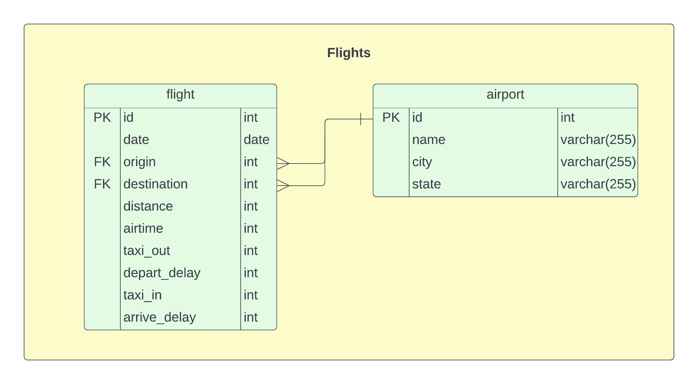

# DestinationsUS
A simple ETL pipeline in Scala utilizing the [Typelevel](https://typelevel.org) libraries.

### Overview

The goal of this project is to build a data pipeline to safely ingest transit data pertaining to US air travel from the [Bureau of Transportation Statistics](https://transtats.bts.gov) and load them into a PostgreSQL database. This data can be downloaded as zip files containing a data dictionary and a csv file. A general overview of the pipeline is depicted below.

The database that the flights are written to is a simple data model only containing 2 tables. The first table consists of airports and the second flights. Each flight has an id and a date in which it occurred. This is then paired with a reference to the airport table for the origin and destination. The entity relation diagram can be seen below.

